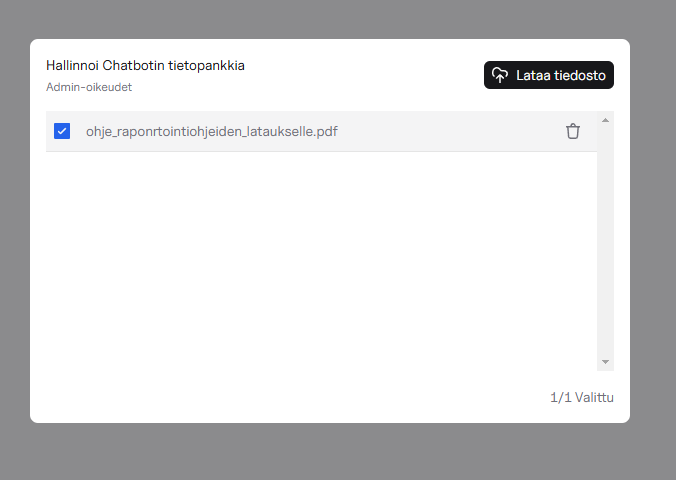
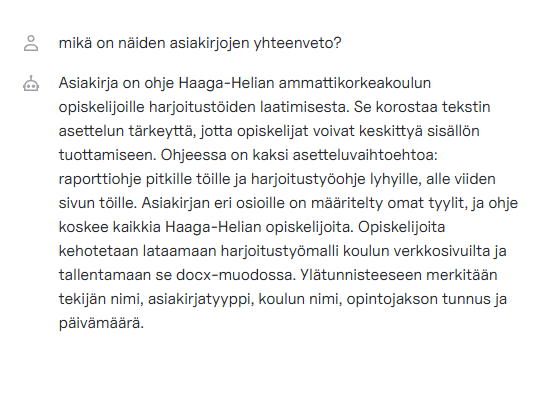
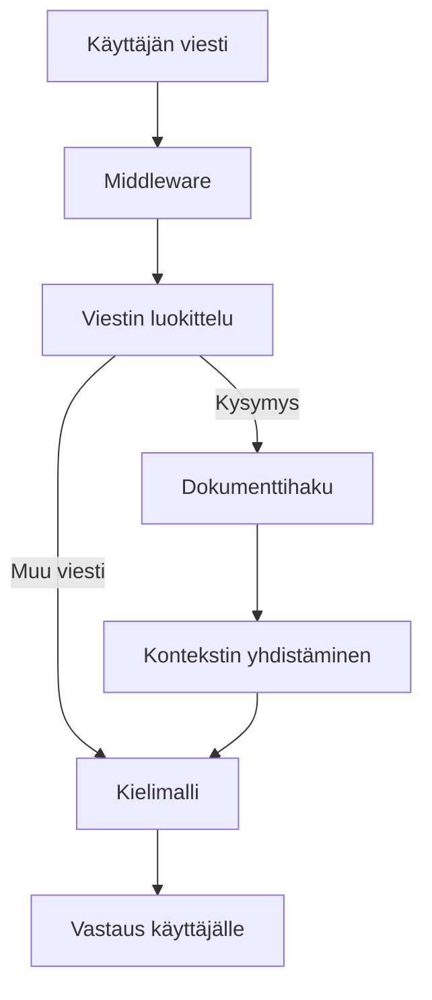

# RAG Chatbot omalla tietopankilla

Retrieval-Augmented Generation (RAG) chatbot-toteutus, joka on rakennettu käyttäen Next.js:ää, Vercel AI SDK:ta ja OpenAI:ta. Chatbot mahdollistaa käyttäjien omien dokumenttien lataamisen, joita käytetään keskustelujen tietopankkina.

## Ominaisuudet

- 🤖 RAG-pohjainen chatbot OpenAI:n malleilla
- 📁 Tiedostojen latausmahdollisuus omaan tietopankkiin
- 🔍 Älykäs dokumenttien pilkkominen ja upottaminen
- 🗄️ PostgreSQL-tietokantaintegraatio upotuksien tallentamiseen
- 🔐 Käyttäjien tunnistautuminen
- ⚡ Rakennettu Vercelin serverless-infrastruktuuriin
- 👥 Käyttäjäroolit (user/admin)
- 🔍 Integroitu Google-haku antiikkiliikkeille Serper API:n kautta

## Vaatimukset

Ennen aloittamista varmista, että sinulla on:

- Node.js asennettuna
- Vercel-tili (https://vercel.com)
- API-avaimet seuraaville:
  - OpenAI
  - Serper (antiikkiliikkeiden hakutoimintoa varten) ( Toimii myös ilman, mutta chatbot heittää virheen jos kysymys liittyy antiikkiliikkeisiin)

## Aloittaminen

1. Kloonaa repositorio
2. Luo `.env.local` tiedosto `.env.example` tiedoston pohjalta
3. Asenna riippuvuudet:
   ```bash
   npm install
   ```

Jos sinulla ei ole vielä Vercel-tiliä tai alustettua tietokantaa:

4. Luo tili Verceliin (https://vercel.com)
5. Alusta uusi projekti Vercelissä
6. Luo PostgreSQL-tietokanta Vercelin kautta
7. Alusta tietokanta:
   ```bash
   npm db:migrate
   ```
   Tämä ajaa migraatiot käyttäen Drizzle ORM:ää.

Jos sinulla on jo Vercel-tili ja tietokanta alustettuna:

4. Yhdistä projekti olemassa olevaan Vercel-projektiisi
5. Käynnistä kehityspalvelin:
   ```bash
   npm run dev
   ```

## Muutokset tietokantaan

Projekti käyttää Vercel Postgres ja Drizzle ORM:ää. Tietokanta alustetaan automaattisesti komennolla:

```bash
npm db:migrate
```

Tämä suorittaa migraatioskriptin (`migrate.ts`), joka luo kaikki tarvittavat taulut.

Jos teet muutoksia tietokantaskeemaan (`schema.ts`):

```bash
npm run db:generate   # Generoi uudet migraatiot
npm run db:migrate   # Aja migraatiot
```

## Tunnistautuminen

Tunnistautuminen hoidetaan NextAuth.js:llä. Oletuksena sovellus käyttää käyttäjätunnus/salasana-tunnistautumista. Voit muokata tunnistautumisasetuksia tiedostossa:

```
app/(auth)/auth.config.ts
```

Rekisteröitymisen käyttöönottamiseksi lisää rekisteröitymispolku tunnistautumiskonfiguraatioon.

## Tiedostojen lataus ja RAG-toteutus

Sovelluksen RAG-toteutus koostuu kahdesta pääosasta:

1. Tiedostojen käsittely (`app/api/files/upload`):

   - Dokumenttien pilkkominen pienempiin osiin
   - Upotuksien luominen OpenAI:n embedding-mallilla
   - Tietojen tallennus Vercel Blob Storageen ja PostgreSQL-tietokantaan

2. Retriever-toiminnallisuus (`ai/rag-middleware.ts`):
   - Analysoi jokaisen käyttäjän viestin
   - Luokittelee viestin tyypin (kysymys, väite, muu)
   - Luo hypoteettisen vastauksen kysymykseen
   - Hakee tietokannasta relevanteimmat dokumentin osat käyttäen upotuksia ja kosinietäisyyttä
   - Lisää löydetyn kontekstin alkuperäiseen viestiin ennen kielimallille lähettämistä

Tiedostojen lataukset käsitellään `app/api/files/upload`-endpointissa, jossa dokumentit:

- Pilkotaan käyttäen RecursiveCharacterTextSplitter:iä
- Upotetaan käyttäen OpenAI:n text-embedding-3-small mallia
- Tallennetaan Vercel Blob Storageen ja PostgreSQL:ään

## Käyttörajoitukset

Koska sovellus käyttää Vercelin ilmaista tasoa:

- Vältä tarpeettoman suurien tiedostojen lataamista
- Huomioi kuukausittaiset serverless-funktioiden suoritusrajoitukset
- Huomioi tietokannan tallennustilan rajoitukset

## Käyttäjäroolit ja oikeudet

Sovelluksessa on kaksi käyttäjäroolia:

- **User**: Peruskäyttäjä, joka voi:
  - Käyttää chatbottia
  - Selata tietopankin dokumentteja
  - Valita dokumentteja chatbotin käyttöön
- **Admin**: Ylläpitäjä, joka voi:
  - Kaikki peruskäyttäjän oikeudet
  - Lisätä uusia dokumentteja tietopankkiin
  - Poistaa dokumentteja tietopankista
  - Hallinnoida tietopankkia

Admin-oikeuksien antaminen käyttäjälle kannassasi:

```sql
UPDATE "User" SET role = 'admin' WHERE email = 'user@example.com'
```

### Antiikkiliikkeiden haku

Sovellus sisältää erityistyökalun antiikkiliikkeiden hakuun Suomessa käyttäen Serper API:a. Tämä toiminnallisuus on toteutettu chat-reitissä ja työkalujen konfiguraatiossa.

```javascript
  tools: {
      searchAntiqueStores: searchSerperLocations,
    },
```

## Tiedostojen jakamistila (STORAGE_MODE)

Sovellus tukee kahta eri tiedostojen jakamistilaa:

- **shared**: Kaikki tiedostot ovat jaettuja kaikkien käyttäjien kesken. Sopii esim. organisaation yhteiselle tietopankille.
- **user-specific**: Jokaisella käyttäjällä on oma tiedostokansionsa. Sopii kun käyttäjien tiedot halutaan pitää erillään.

Valitse sopiva tila asettamalla `STORAGE_MODE` ympäristömuuttuja:

```bash
STORAGE_MODE="shared"        # Jaettu tiedostopankki
# tai
STORAGE_MODE="user-specific" # Käyttäjäkohtaiset tiedostot
```

## Antiikkiliikkeiden haku

Chatbot sisältää erityistyökalun antiikkiliikkeiden hakuun Suomessa käyttäen Serper API:a. Voit kysyä chatbotilta esimerkiksi:

- "Etsi antiikkiliikkeitä Helsingistä"
- "Mistä löydän antiikkiliikkeitä Tampereelta?"

## Tekninen toteutus

- Next.js
- Vercel AI SDK
- OpenAI API
- PostgreSQL (Vercel)
- Drizzle ORM
- NextAuth.js
- Vercel Blob Storage
- Tailwind CSS

## Tärkeät huomiot

- Muista hoitaa tietokannan migraatio käyttöönotossa
- Seuraa Vercelin käyttörajoituksia
- Suojaa API-avaimesi ja ympäristömuuttujat
- Harkitse maksullisiin tasoihin siirtymistä, jos tarvitset korkeampia käyttörajoja

## Käyttöliittymä ja toiminnallisuus

### Tiedostojen valinta ja kontekstin luonti

Käyttäjä voi valita yhden tai useamman tiedoston tietopankista chatbotin kontekstiksi. Tiedostoja ei ole pakko valita, jolloin chatbot toimii ilman dokumenttikontekstia.



### Chatbotin toiminta

Kun käyttäjä kysyy kysymyksen, chatbot analysoi sen ja hyödyntää valittuja dokumentteja vastauksessaan:



### Middleware-logiikka

Chatbot hyödyntää [Vercel AI SDK:n middleware-toiminnallisuutta](https://sdk.vercel.ai/docs/ai-sdk-core/middleware). Jokainen käyttäjän viesti kulkee middleware-kerroksen läpi seuraavan prosessin mukaisesti:

1. Middleware vastaanottaa käyttäjän viestin
2. Viesti luokitellaan (kysymys, väite tai muu)
3. Jos viesti on kysymys:

- Haetaan valituista dokumenteista relevantit osat
- Luodaan hypoteettinen vastaus kysymykseen
- Yhdistetään dokumenttikonteksti ja hypoteettinen vastaus

4. Jos viesti on muu kuin kysymys:

- Edetään suoraan kielimalliin

5. Kielimalli generoi lopullisen vastauksen



## Lisenssi

MIT License - katso [LICENSE](LICENSE) tiedosto lisätietoja varten.
